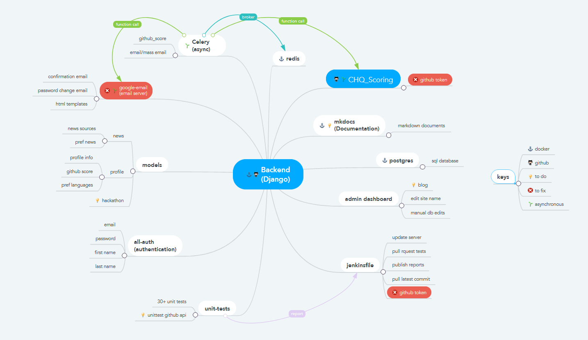

# Coders HQ Backend

This repository holds the Coders-HQ backend. It is made using [Django](https://www.djangoproject.com/) and [Postgres](https://www.postgresql.org/) as an API backend to the Coders-HQ frontend (based on [React](https://reactjs.org/)) which is hosted [in this repo](https://github.com/Coders-HQ/CHQ_Frontend). The main Coders-HQ website is hosted at [codershq.ae](https://codershq.ae).

All information relating to the databse and tokens/secrets are should be in a `.env` file. An example of the file is the `.env.example` copy and edit the conttents to suite your environment and save it as `.env` in the root directory.

## Installation

Docker and docker-compose are used to build and connect the subset of apps that are required to run the backend.

### Pre requisites

1.  [docker](https://docs.docker.com/get-docker/)
2.  docker-compose
3.  (Optional) httpie

### Building on Docker

1. Copy `.env.example` to `.env` and edit with your github token, django secret, etc.
2. Run `docker-compose up backend` 
3. On a web browser open [localhost:33325](http://localhost33325)

## API

All information related to the API, and how to use it, can be found [here](https://documenter.getpostman.com/view/13659675/TVmJjeuV).

## Architecture

The front-end will be located [in its own repository](https://github.com/Coders-HQ/CHQ_Frontend) which can connect to django's REST framework. The REST framework makes it easy to integrate any frontend to django's API which makes it possible to work on the front and backend separately. 

The final architecture combines a subset of apps together to run all the different functionalities that's needed for the backend.

The main apps are:

| Django                    | Main backend                             |
|-------------              |------------------------------------------|
| [CHQ_Scoring](https://github.com/Coders-HQ/CHQ_Scoring)               | Scoring mechanism for CHQ Backend        |
| MKDocs                    | Documentation tool                       |
| Postgres                  | Database server                          |
| Jenkins                   | Unit tests and server build              |
| Celery                    | Async events                             |
| Redis                     | Message broker between celery and Django |

__Currently the docker-compose.yml is located inside this repository but will eventually be pulled out top integrate the frontend with the backend.__

## Database

Postgres is pulled when using the `docker-compose` command and the databse name/user/password are all grabbed from the `.env` file. The data is stored at `/var/lib/codershq/postgres/`. 